# Codex Auth Manager

[](https://github.com/SanjiFlip/codex-auth-manager/actions/workflows/ci.yml)
[](https://github.com/SanjiFlip/codex-auth-manager/releases/tag/v0.6.0)
[](LICENSE)

Windows / macOS Codex 桌面端的本地多账号管理工具。基于 GboyCode/CodexAuth 的 Electron 与加密管理能力，参考 Mintimate/codex-auth-switch 的登录、额度与环境检查流程，采用中性灰与系统蓝主题，提供 Codex Meter 悬浮窗、蒸馏工作台与本地记忆库。

> 非 OpenAI 官方产品。当前 v0.6.0 为预览版；Windows 未签名，macOS 仅 ad-hoc 签名；真实账号登录与桌面端切换仍需实际验收，详见下文限制。

## v0.6.0 · Skills 管理与可恢复蒸馏

修复刷新额度后被本地零值覆盖为 100%：只有日志确认已跨过重置边界时才接受本地归零，模型专属额度与账号额度分开处理；主界面和悬浮窗共用修复后的结果。

蒸馏现支持 **大项目自动分批、分阶段整合、断点续跑**：移除原 24 万字符门槛，逐批加密保存检查点，暂停或重启后继续，完整证据随草稿保留并可导出。[运行边界与恢复说明](docs/KNOWLEDGE.md#大项目自动分批与断点续跑)。Skills 商店在 GitHub API 限流时优先使用缓存，并提供官方仓库快照备用读取通道。

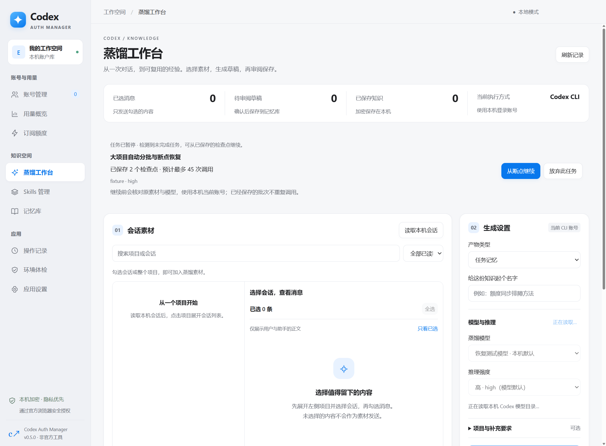

新增 **Skills 管理**：浏览本机技能、编辑日常 / 科研等场景分组、多组启用与切换；从 OpenAI、Anthropic、科研工具箱或自定义公开 GitHub 仓库预览和安装。保留现有 Skills Hub 文件与链接，通过官方 Codex 配置服务保存启用状态；安装先入库，切换后请重启 Codex。自定义来源可命名、保存、编辑和移除，重启后保留；编辑分组支持全选 / 取消全选。商店可设置本机加密的 GitHub Token，减少目录刷新限流。详见 [Skills 使用说明](docs/SKILLS.md)。

| 场景分组 | 技能商店 |
| --- | --- |
| 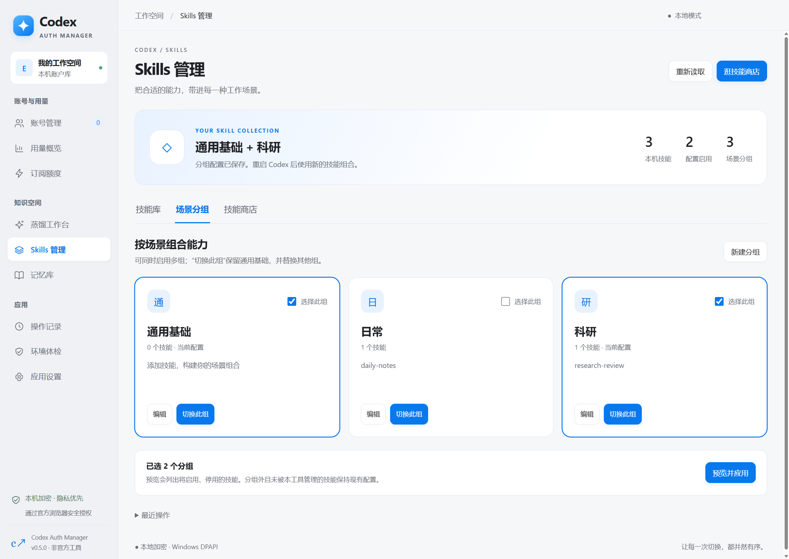 | 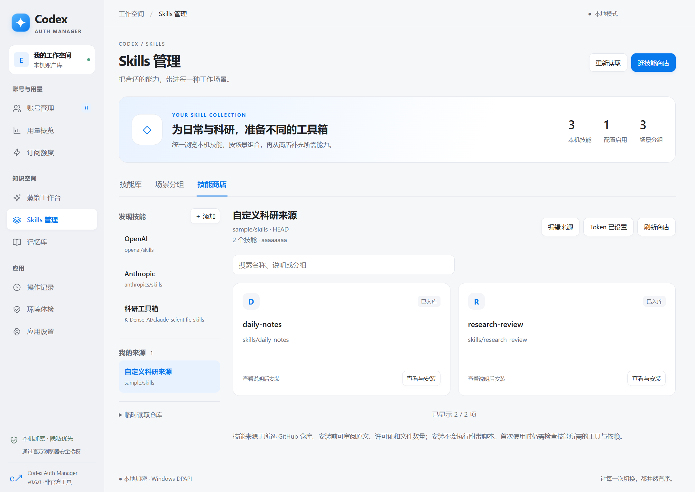 |

修复本机会话列表漏项：默认全部时间，显示全部合格会话，不再跳过大于 32 MB 的文件；失效路径按有效会话 ID 定位，缺少正文时保留条目。大文件按需读取最近范围，并清楚提示限制。

项目与会话标题左侧新增勾选框，支持整项目选择和部分选中状态。勾选覆盖折叠及筛选外的已读取会话；归档聊天仍排除。蒸馏采用分批提取、多层结构化整合和原文引用校验，开始前显示模型调用次数，结果先保存为草稿。技术参考、上限与人工审阅边界见 [使用说明](docs/KNOWLEDGE.md#分批蒸馏与校验)。

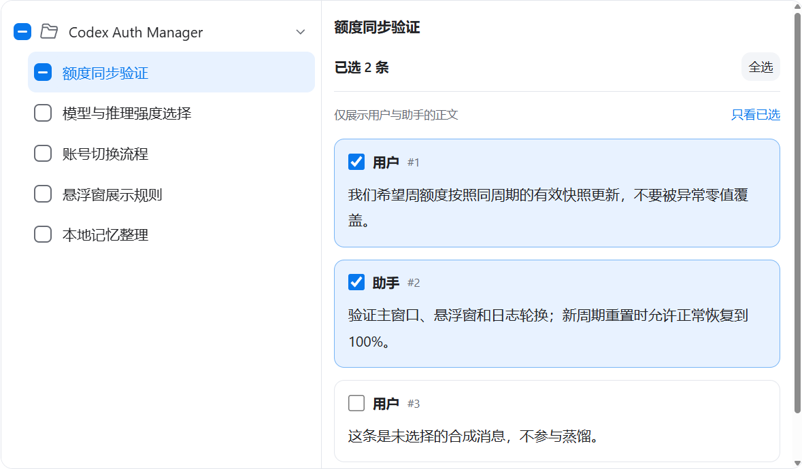

## 工作空间与知识管理

Windows EXE 和两种 macOS 架构的 DMG / ZIP 提供一致的工作空间与知识管理功能。

- 选择本机 Codex 会话中的具体消息，通过本机当前登录的 Codex CLI 生成 Skill、工作流、提示词、个人偏好或任务记忆草稿。
- 统一主窗口、全部功能页与悬浮窗的浅色 / 深色主题；账号卡片前置，Pro 周额度不再出现关闭的五小时占位。
- 蒸馏只读取 Codex 启用项目的未归档会话，并显示项目名称；支持跨页全选、只看已选、取消任务与草稿审阅。
- 模型及推理强度直接读取本机模型目录并联动选择，开始前再次校验；记忆库支持分类、排序、搜索、来源与 Markdown 导出。
- 合并重复读取、缓存不变会话、限制长列表的渲染数量；可复现的合成数据测量见 [界面与性能验证](docs/UI_PERFORMANCE.md)。
- 草稿和记忆通过系统加密保存在独立知识库，跨账号共用；不会自动安装 Skill，也不会改写 Codex 原生记忆目录。
- 蒸馏需要联网并消耗当前账号额度；会先确认所选素材，不自动批量处理会话。

操作方式、CLI 要求和数据边界见 [蒸馏与记忆使用说明](docs/KNOWLEDGE.md)。以下为工作空间的 Windows 隔离测试界面，全部内容为合成示例。

| 蒸馏工作台 | 记忆库 |
| --- | --- |
| 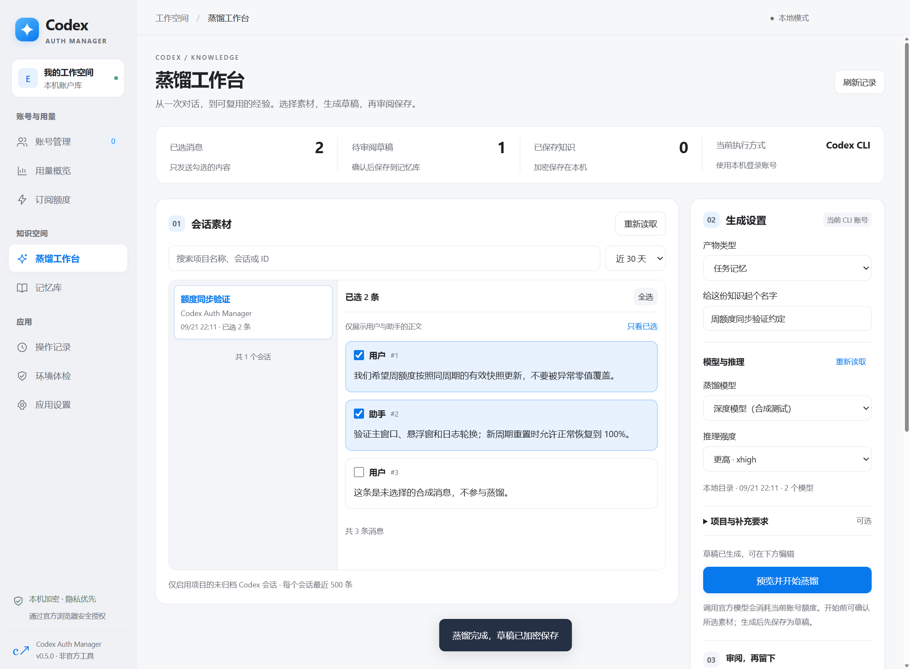 | 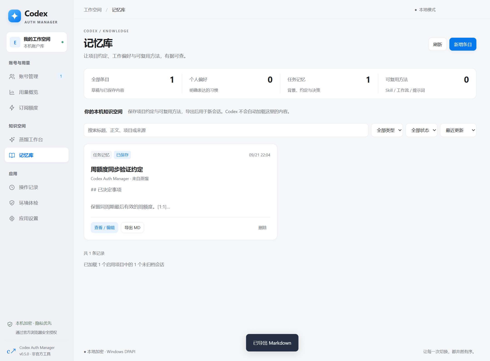 |

| 账号工作空间 | 桌面悬浮窗 |
| --- | --- |
| 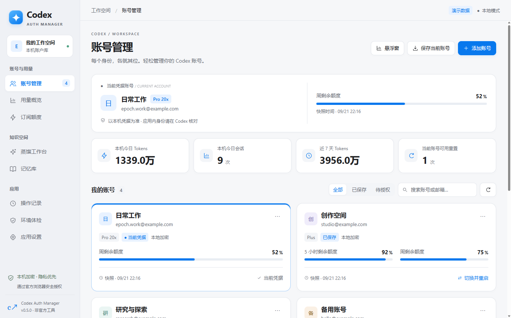 | 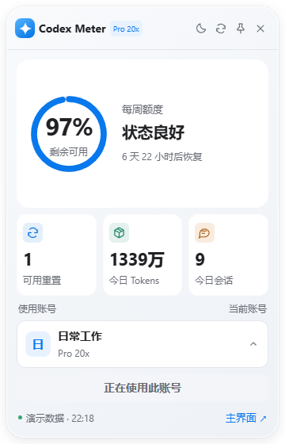 |

## 下载安装包

当前版本：**v0.6.0 预览版**。请按操作系统和处理器选择安装包。

| 平台 | 系统要求 | 安装包 |
| --- | --- | --- |
| Windows x64 | Windows 10 / 11 | [EXE 安装程序](https://github.com/SanjiFlip/codex-auth-manager/releases/download/v0.6.0/Codex-Auth-Manager-Setup-0.6.0-x64.exe) |
| macOS Apple Silicon | macOS 14+，M 系列芯片 | [DMG](https://github.com/SanjiFlip/codex-auth-manager/releases/download/v0.6.0/Codex-Auth-Manager-0.6.0-arm64.dmg) · [ZIP](https://github.com/SanjiFlip/codex-auth-manager/releases/download/v0.6.0/Codex-Auth-Manager-0.6.0-arm64.zip) |
| macOS Intel | macOS 14+，Intel 芯片 | [DMG](https://github.com/SanjiFlip/codex-auth-manager/releases/download/v0.6.0/Codex-Auth-Manager-0.6.0-x64.dmg) · [ZIP](https://github.com/SanjiFlip/codex-auth-manager/releases/download/v0.6.0/Codex-Auth-Manager-0.6.0-x64.zip) |

[发布说明](https://github.com/SanjiFlip/codex-auth-manager/releases/tag/v0.6.0) · [SHA-256 校验文件](https://github.com/SanjiFlip/codex-auth-manager/releases/download/v0.6.0/SHA256SUMS-0.6.0.txt) · [所有版本](https://github.com/SanjiFlip/codex-auth-manager/releases)

Windows 为未签名预览版；Mac 仅作本机 ad-hoc 签名，未进行 Apple Developer ID 签名和公证。Mac 下载后把应用拖到 Applications；若被 Gatekeeper 拦截，请在确认下载来源后使用系统「隐私与安全性」中的打开选项，不要关闭系统安全保护。

更新前从托盘或 macOS 菜单栏完全退出旧版管理工具。Windows 运行安装程序并选择原安装目录；Mac 将新版应用替换到 Applications。跨设备迁移请使用加密导出 / 导入，不要直接复制账户库。

## 最新更新 · v0.6.0

本版新增 Skills 技能库、场景分组与商店，支持自定义来源和分组全选。蒸馏支持整项目勾选、大项目分批、多阶段整合与断点继续；修复本机会话漏项、GitHub 商店限流及额度刷新后回跳 100%。详见 [更新日志](CHANGELOG.md)。

Windows 与 macOS 两种架构的 [构建及检查均通过](https://github.com/SanjiFlip/codex-auth-manager/actions/runs/35611375983)。Windows 另完成实际 EXE 检查，Mac 两种架构均完成打包后的蒸馏、窗口与账号导入检查。测试使用隔离账户库、合成凭据与模型返回，不等于真实账号在线身份验收。详见 [更新日志](CHANGELOG.md) 和 [验证记录](docs/VALIDATION.md)。

## 界面与功能预览

以下基础页面截图来自 Electron 隔离演示，Windows 与 macOS 桌面应用使用同一套界面。账号、额度及用量均为示例数据，不包含真实账号信息；点击图片可查看原图。

### 账号管理 · 多个身份，一处管理

集中查看当前账号、Pro 20x / Pro 5x / Plus 套餐、本机今日用量和近 7 天趋势。支持添加账号、搜索筛选、保存当前账号，以及切换并重启 Codex。

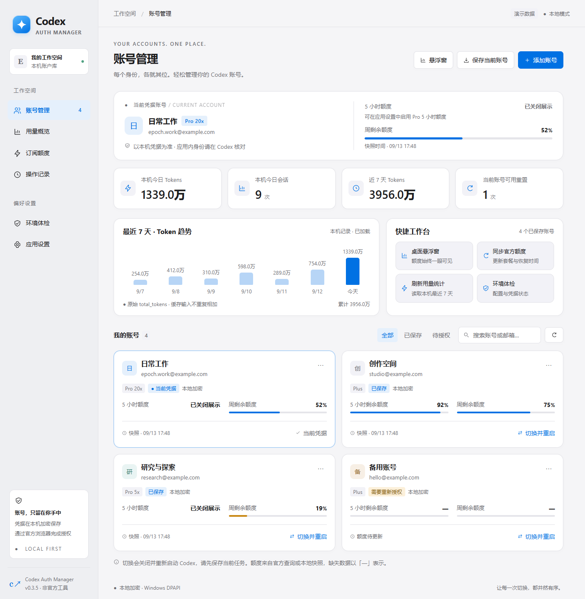

### 桌面悬浮窗 · 额度与用量随时可见

Pro 关闭五小时展示时以周额度为主仪表；Plus 展示五小时与每周两个额度窗口。悬浮窗支持本地刷新、置顶、明暗主题和账号选择，确认目标后再切换。

| Pro 周额度模式 | Plus 双额度深色模式 | 账号选择 |
| --- | --- | --- |
| 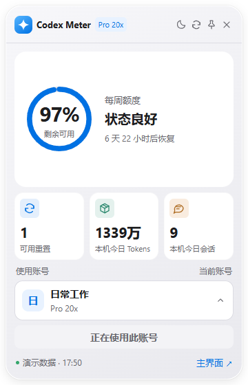 | 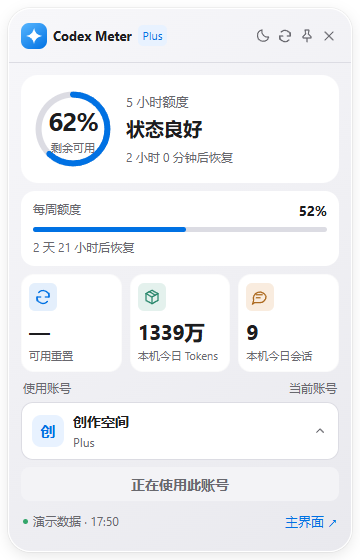 | 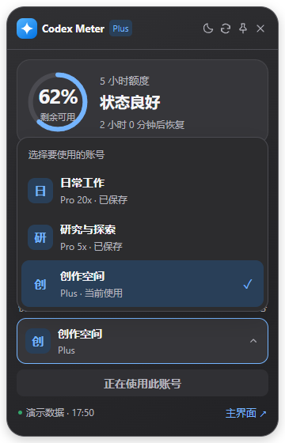 |

### 用量概览 · 从总量看到明细

查看本机今日及近 7 天 Tokens、会话数量、每日趋势、模型分布和 Token 构成。缓存输入与推理输出单独展示，不重复计入总量。

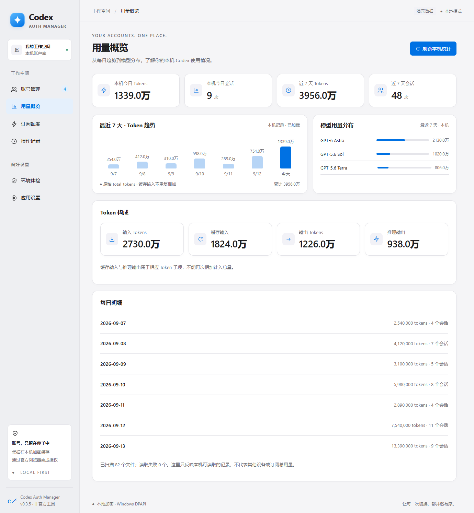

<details>
<summary><strong>展开查看：订阅额度与应用设置</strong></summary>

### 订阅额度

按账号展示 Pro 5x / Pro 20x / Plus 套餐、剩余额度、恢复时间和可用重置次数；提供单账号及批量官方刷新入口。自动同步默认读取本地记录，官方刷新需要主动点击。

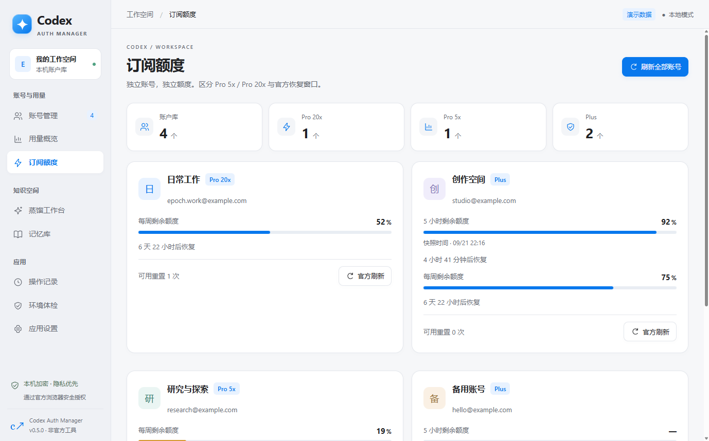

### 应用设置

配置 Pro 五小时额度展示、明暗主题、隐私显示和开机启动，并管理本地数据与加密迁移文件。Pro 开关只控制展示，不改变官方限制。

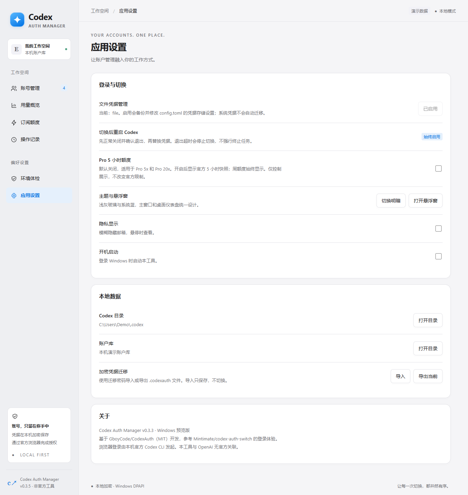

</details>

## 从源码运行

需要 Windows 10 / 11 或 macOS 14+、Node.js 22 或更高版本、npm 与 Git。

```powershell
git clone https://github.com/SanjiFlip/codex-auth-manager.git
cd codex-auth-manager
npm ci
npm start
```

- 演示：`npm run demo`，使用独立演示数据，没有真实账号 IPC。
- Windows 构建：`npm run dist`，输出到 `release/`。
- macOS 构建：在 Mac 上运行 `npm run dist:mac`，生成 arm64 / x64 的 DMG 与 ZIP。
- 安装：构建后运行 `release/Codex Auth Manager Setup 0.6.0.exe`；更新时先退出旧版管理工具，再选择原安装目录。
- 免安装：构建后使用 `release/win-unpacked/` 整个目录，不能只复制 EXE。

Git 源码目录不包含构建产物，安装包通过本仓库 Releases 提供。

添加账号与查询官方额度需要本机 Codex CLI；开发机验证版本为 `codex-cli 0.154.0`。Windows 支持 Store / MSIX 安装；macOS 支持安装在 /Applications 或 ~/Applications 下的 Codex.app / ChatGPT.app。

macOS 支持从 PATH、`/opt/homebrew/bin`、`/usr/local/bin`、`~/.local/bin` 查找 Codex CLI。Finder 启动的应用不会自动继承交互式 shell 配置；仅安装在 nvm 私有目录中的 CLI 需要加入应用可见的 PATH，或安装到上述可发现目录。

## 主要功能

- 官方浏览器登录：独立临时 CODEX_HOME，授权成功后加密保存，可取消和重新打开授权页。
- 账号保存、重命名、搜索、筛选、删除；重复身份更新已有记录。
- 切换前校验、正常关闭 Codex、确认退出、保存当前最新凭据、原子替换、重新启动；失败恢复原凭据。
- Pro 5x / Pro 20x 分开显示，官方套餐与额度按账号查询或批量刷新。
- 5 小时与每周剩余额度、恢复倒计时、官方可用重置次数；缺失值显示「—」。不提供兑换重置。
- 今日 Tokens / 会话、近 7 天趋势、模型分布、输入 / 缓存 / 输出 / 推理 Token 构成、每日明细。
- 独立桌面悬浮窗：额度环、每周进度、三项统计、切换账号、置顶、明暗主题、返回主窗口。打开悬浮窗时关闭主窗口会保留浮窗。
- 应用设置：隐私显示、明暗主题、开机启动、加密文件导入导出、数据目录入口。
- 环境体检：版本、文件凭据模式、凭据识别、同步、日志数据库与会话文件检查。
- 主窗口、悬浮窗、EXE 图标和标题栏采用同一浅灰与系统蓝主题。

具体参考、实现路径和未纳入的上游功能见 [功能对照](docs/FEATURE_MATRIX.md)。

## 使用流程

1. 在「应用设置」检查凭据管理。切换要求 `cli_auth_credentials_store = "file"`，点击启用会先备份配置；程序启动不自动修改此设置。系统钥匙串凭据需要重新授权，不能自动迁移。
2. 点击「保存当前账号」，或通过「添加账号」在官方浏览器授权。添加只保存，不自动替换当前账号；浏览器可能自动选择已有会话，请核对身份。
3. 保存当前任务后，点击「切换并重启」。正常退出超时会停止，不默认强杀 Codex；写入或启动失败会先确认停止再恢复凭据。
4. 在重启后的 Codex 账号菜单核对实际身份。文件身份校验与进程启动检查不等于桌面端在线登录成功。
5. 点击「同步官方额度」更新官方快照。统计汇总本机最近 7 天，不代表其他设备或某一个账号的全部用量。

## 数据与限制

- 独立账户库：`%APPDATA%/codex-auth-manager`；DPAPI 加密依赖相同 Windows 用户。Mac 账户库位于 `~/Library/Application Support/codex-auth-manager`，Keychain 加密依赖当前 macOS 用户。索引含邮箱、名称等身份元数据。
- Codex 文件模式的 auth.json 仍是敏感凭据；前端不会收到原始 access / refresh token。
- 登录完成与查询退出后清理临时凭据；在线查询由官方 CLI app-server 发起，不使用第三方额度代理。
- 删除仅删除本工具保存记录，保留当前 Codex 登录。加密迁移文件采用独立迁移密码。
- 不提供云同步、遥测或上游自动更新。操作记录目前只保留本次工具会话。
- 本机统计中的缓存输入和推理输出属于子项，不能再次加进总量。
- 断电、系统崩溃或第三方同时修改文件不具备完整事务恢复保证。
- 未完成真实用户浏览器授权及实际 Codex 在线身份的端到端验收。曾报告的闪退未复现，不能断言所有崩溃原因已排除。
- Windows 安装包未签名；macOS 仅 ad-hoc 签名，未做 Developer ID 签名与公证。

## 开发验证

```powershell
npm run check
npm test
npx electron scripts/smoke-electron.js
npx electron scripts/realtime-smoke.js
```

Windows 打包验证：

```sh
npm run dist
node scripts/packaged-smoke.js
```

macOS 打包验证：

```sh
npm run dist:mac
npx electron scripts/window-lifecycle-smoke.js --packaged
npx electron scripts/knowledge-smoke.js --packaged
node scripts/mac-packaged-smoke.js
```

GitHub Actions 在 Windows 运行语法和单元测试，在两种 macOS 架构运行单元、原生窗口、隔离账号及打包应用检查。完整检查入口见 [贡献说明](CONTRIBUTING.md)。

浏览器演示预览使用 `scripts/preview-server.js`，通过环境变量 `CAM_PREVIEW_PORT` 选择端口；UI 验证脚本使用 4318。`scripts/ui-smoke.js` 使用独立演示数据。

验证证据见 [VALIDATION](docs/VALIDATION.md)。参考版本见 [REFERENCE_REVIEW](docs/REFERENCE_REVIEW.md)。MIT 版权与借鉴范围见 [THIRD_PARTY](docs/THIRD_PARTY.md) 和 [LICENSE](LICENSE)。

## 参与开发与安全

由 [SanjiFlip](https://github.com/SanjiFlip) 维护。使用问题或功能建议请通过 [Issues](https://github.com/SanjiFlip/codex-auth-manager/issues) 提交，附上版本、系统、复现步骤和脱敏截图。安全问题请按 [安全说明](SECURITY.md) 私密报告，不要公开凭据。

请先阅读 [贡献说明](CONTRIBUTING.md) 和 [安全说明](SECURITY.md)。源码采用 MIT 许可，并保留上游版权。
