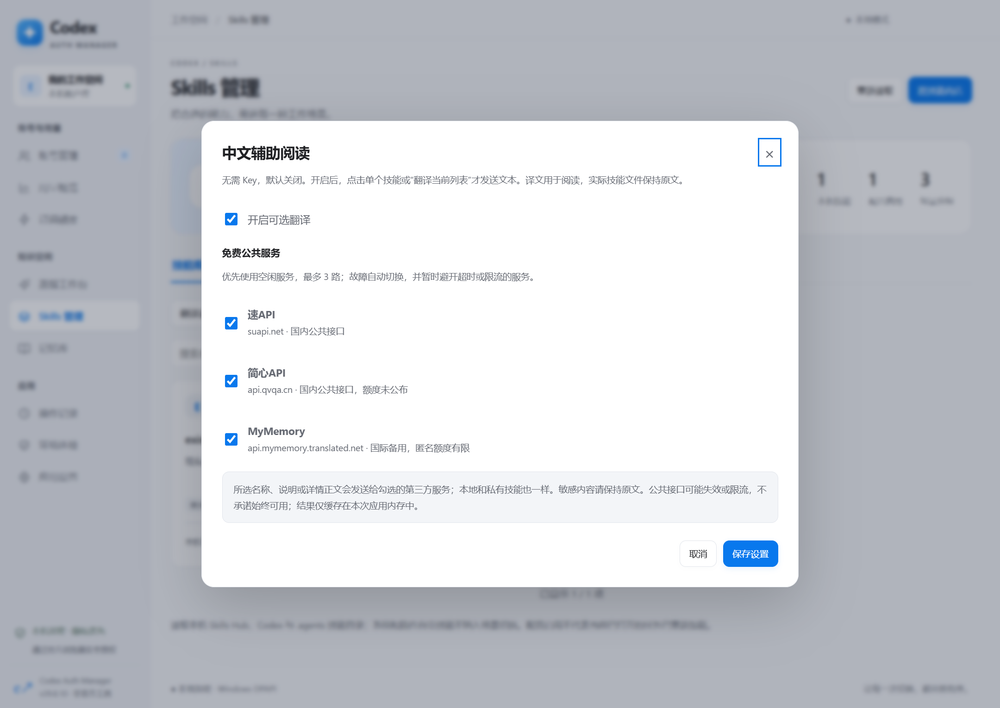

# Skills 管理（v0.6.3 预览版）

## 使用方式

1. 打开「Skills 管理 → 技能库」。读取 `CODEX_HOME/skills`、本机 `.agents/skills` 与 `.skillshub` 中的技能，按真实路径合并已有链接。系统目录与插件自带技能不参与切换。
2. 在「技能商店」选择 OpenAI、Anthropic 或科研工具箱，也可点击「发现技能」旁的「添加」，保存自定义 GitHub 仓库及分支 / Tag / 提交。打开技能，审阅完整 SKILL.md、文件数量和仓库许可证，选择分组后安装。
3. 安装只入库，不自动启用，也不执行附带脚本。在「场景分组」编辑名称和成员，一个技能可以属于多组。内置通用基础、日常、科研，可添加自定义组。编辑分组时，用「全选」「取消全选」操作整个技能列表，已选数量实时更新；底部「取消」放弃未保存修改。
4. 勾选一个或多个组并预览，或点击「切换此组」（保留通用基础，替换其他组）。查看将启用 / 停用的技能，点击「保存启用配置」。
5. 保存任务后自行重启 Codex 使用新组合。工具显示的是配置状态，不能证明正在运行的任务已重新加载。

商店中的已入库技能会显示「已入库 / 查看本机」，打开本地版本的说明；通过安装来源识别，不把不同仓库中的同名技能视为同一个。移除分组后，该组也会从待应用的选择中移除，已安装文件保持不变。配置路径在每次扫描内复用解析结果，下次扫描重新解析，避免链接目标变更后沿用旧状态。

## 自定义来源

- 「我的来源」保存来源名称、仓库及引用，重启应用后仍可直接点击。仓库填写 `owner/repo` 或 `https://github.com/owner/repo`；分支 / Tag / 提交单独填写，留空使用 `HEAD`。不填写 `/tree/...` 页面地址。
- 每个自定义来源旁的「⋯」可编辑或移除；即使目录加载中或仓库无法访问也可使用。选择来源后也可点击标题右侧的「编辑来源」。删除不再等待远程目录，旧请求晚到也不会恢复已删除的来源。移除仅删除收藏，不删除已安装技能、不改变分组及启用状态。内置来源保留。
- 「临时读取仓库」支持不保存直接浏览；读取后可「保存为来源」。离线也能保存来源，网络恢复后再读取目录；保存不代表仓库已验证可访问。
- 每个应用数据目录最多保存 40 个自定义来源；同一仓库和相同引用不可重复添加。支持公开仓库和 Token 有权访问的私有仓库。

## 可选中文翻译

在 Skills 页面打开「翻译设置」，勾选「开启可选翻译」并选择服务。默认关闭，保存设置本身不发起翻译；点击技能的「译成中文」或「翻译当前列表」后才发送文本。市场翻译技能名称，本地列表翻译名称与说明；详情窗口的「翻译正文」支持完整正文的分段翻译，原文始终保留。不会覆盖 SKILL.md，也不改变启用或安装行为。

开关与服务选择保存在本机。升级保留已保存的选择，不会自动把简心API 加入已有选择；需要使用新增服务时，在设置中主动勾选。没有保存过设置时，3 个服务预先勾选，但翻译总开关仍然关闭。

| 可选服务 | 请求域名与公开来源 | 已知限制 |
| --- | --- | --- |
| 速API | `suapi.net`；[通用翻译文档](https://suapi.net/doc/51) | 文档标注免 Key，每日 100000 次、每秒 50 次；这些是服务方公布的上限，不是本工具的请求速度或可用性保证。 |
| 简心API | `api.qvqa.cn`；[作者署名的公开接口说明](https://api.aa1.cn/doc/fanyii.html) | 使用公开的 `/api/fanyi` 无 Key 接口，传入 `text`、`source=en`、`target=zh`，读取 `data.targetText`。未找到明确公布的单次文本长度、日配额、请求频率或可用性承诺。 |
| MyMemory | `api.mymemory.translated.net`；[官方接口说明](https://mymemory.translated.net/doc/spec.php) | 单次查询最多 500 UTF-8 字节；匿名日额度有限，以[使用限制](https://mymemory.translated.net/doc/usagelimits.php)为准，耗尽后暂停使用该通道。 |

简心API 于 2026-09-22 在本机以 411 UTF-8 字节的合成英文段落获得完整 JSON 译文，无需凭据；这只证明当时本机可访问。各地运营商连通性、长期稳定性和服务方上游实现未验证。全部公共服务都可能失效、限流或调整免费政策。

正文按小片段分派给所选服务，优先使用空闲服务；每个正文最多 3 路，每个服务在所有翻译任务间共用独立队列，同时最多 1 个请求，两次请求开始至少间隔 650 ms。每次请求超时 8 秒，限流和连续故障触发退避；失败时仅尝试其他已勾选的服务，不绕过限流或验证码。本工具把片段限制在 450 UTF-8 字节以内，这是本地策略，不代表简心API 公布了该限制。

同一正文中的重复片段合并请求。成功片段仅在应用进程内存缓存，最多 1000 段；再次翻译时可复用，新的网络请求只使用当次勾选的服务。正文随进度逐步显示，尚未完成的部分保留原文；部分失败可重试并复用已成功片段。完整正文也会在当前界面进程内存缓存，重新打开详情先显示原文，点击「翻译正文」才恢复完整缓存或发送请求；部分结果不会冒充完整缓存。缓存不写磁盘，关闭应用后消失。

更换勾选的服务后会清除界面完整译文缓存，再次点击使用新的选择；仅关闭 / 开启翻译或改变勾选顺序不会清除缓存。手动隐藏译文后，后续进度不会强行展开。

每个正文任务最多 60000 字符，支持停止；关闭翻译总开关会停止当前任务。YAML 头部、代码块、行内代码、URL 保持原文；译文只用于辅助阅读，机器翻译可能不准确。停止可以取消本地等待和请求，无法撤回已经发送的文本。

文本发送给所选第三方；本地或私有技能同样会外发选中的名称、说明或正文。敏感技能请保持原文。请求不会附带 Codex 凭据、GitHub Token 或本机路径；文本自身包含的信息需自行判断是否适合外发。

## 本地文件和兼容性

- 保留 Skills Hub 的源文件与现有链接，不修改它的数据库。新安装技能放在 `.skillshub/cam-名称-来源标识`，应用时链接到 Codex skills 目录；同名目标拒绝覆盖。
- 通过本机 Codex CLI 的隐藏 `app-server` 使用 `config/read` 和带版本校验的 `config/batchWrite`，只修改 `skills.config`。保留无关设置和注释，不请求登录、额度或模型生成。需要支持这两个方法的官方 CLI；旧版本报错时请升级。
- 配置依据用户层的技能规则；企业策略、项目规则或运行中的会话还可能影响实际可用状态。组外且从未被此工具管理的技能保持原配置；曾被管理的技能移出组后会在下次应用时停用。
- 分组、自定义来源和安装记录存于应用数据目录下 `skills/library.json`，配置更改前将原有技能规则记录到 `skills/last-apply.json`，不复制包含其他设置的完整 config.toml。
- 分组编辑与安装、应用使用版本校验；过期预览需重新读取。启用过程如配置保存后链接失败会明确报告，并保留恢复记录，不声称已完成。

## GitHub Token

商店标题右侧的「GitHub Token」可保存、更换或移除 Personal Access Token。点击「保存并刷新」会立即以认证请求重新读取目录；已有 Token 不回显。没有 Token 也能通过匿名访问、缓存和仓库快照读取。

- Token 仅通过系统加密保存在应用数据目录的 `skills/github-token.enc`，不会进入来源列表、分组、导出或 Git 仓库；无法使用系统加密时拒绝保存。
- Token 只发送到 `https://api.github.com`，禁止自动跟随重定向，不发送到 raw 文件、Git refs 或 codeload 下载通道。
- 公开仓库只需公开数据读取能力；私有仓库请在 fine-grained Token 中选择对应仓库，并授予 **Contents: Read-only**。不需要写入权限，不读取 Git / gh 的已有认证。可在 [GitHub 设置](https://github.com/settings/personal-access-tokens) 创建专用 Token。
- 认证请求提高 API 请求额度、减少匿名限流；网络速度仍取决于连接情况。配额与其他调用共享，仍可能限流，见 [GitHub 限流说明](https://docs.github.com/en/rest/using-the-rest-api/rate-limits-for-the-rest-api)。Token 过期或撤销时更新或移除即可。

## 商店边界

- 支持公开仓库和授权的私有仓库。内置来源只浏览约定目录；自定义来源递归寻找所有层级的 SKILL.md。私有文件通过带认证的 API blob 接口下载，Token 不发送到公开下载域名。私有目录缓存仅在内存中，按 Token 隔离；更换或移除 Token 后旧预览不能安装。已安装技能按本机技能库规则保存。
- 目录缓存 10 分钟、内存最多 16 份；公开目录限流或离线时优先展示缓存。取消前 500 项截断，GitHub 递归树不完整时继续读取子目录；保护上限为 20 万目录条目 / 1000 次递归目录请求。卡片每批显示 60 项，可继续加载，搜索覆盖全部已读取技能。
- 预览绑定具体提交，10 分钟有效。安装最多 4 路并发下载，逐个核对 Git blob 摘要；拒绝目录穿越、符号链接、子模块、大小写冲突与覆盖已有目录。单技能最多 500 个文件、单文件 2 MB、总计 20 MB。
- 保留完整技能文件及所找到的仓库许可证。没有许可证时显示缺失，用户需确认使用许可。GitHub API 限流时记录恢复时间，不反复请求。无缓存时自动通过 GitHub 官方 Git 引用与 codeload 快照读取固定提交，无需 Git 命令或必须配置 GitHub Token；同一目录的并发请求合并。所有可用通道均不可达时显示简洁错误，不显示内部 IPC 调用堆栈。
- 科研工具箱已适配上游 `K-Dense-AI/scientific-agent-skills`，旧 `claude-scientific-skills` 地址自动转换。API 限流且无缓存时通过本机 Git 读取浅层 commit/tree 对象，不下载文件 blob、不检出仓库、不弹认证窗口；预览和安装才下载选中技能文件。没有 Git 时可安装 Git，或设置 GitHub Token 走 API 通道。
- 仓库快照有 64 MB 压缩体积 / 256 MB 展开体积 / 50000 条目保护限制。超限自动尝试 Git 轻量目录通道；只在内存中解析目录与摘要，不解压到工作目录；安装仍检查固定提交文件摘要及单技能大小限制。
- 技能自己的工具、账号和运行依赖需另行配置；安装成功不等于技能适用于 Codex 或已经验证运行结果。当前不自动更新或卸载技能源文件。

## 验证与维护

`npm test` 包含 YAML、路径、缓存、下载完整性、已有链接、场景组合与版本冲突测试，也覆盖翻译服务队列、取消、渐进显示、缓存与失败重试。`npx electron scripts/skills-smoke.js` 使用隔离数据验证真实 main / preload / 页面流程；加 `--packaged` 检查 ASAR。`node scripts/skills-config-smoke.js` 使用本机官方 CLI 与临时 CODEX_HOME 检查配置保存，不调用模型。翻译性能使用 `node scripts/translation-performance-smoke.js` 的合成响应检查，不访问公共翻译服务；条件见 [性能记录](UI_PERFORMANCE.md#v063-正文翻译调度2026-09-22)。

参考仓库与版本见 [第三方说明](THIRD_PARTY.md)，当前验证范围见 [验证记录](VALIDATION.md)。
