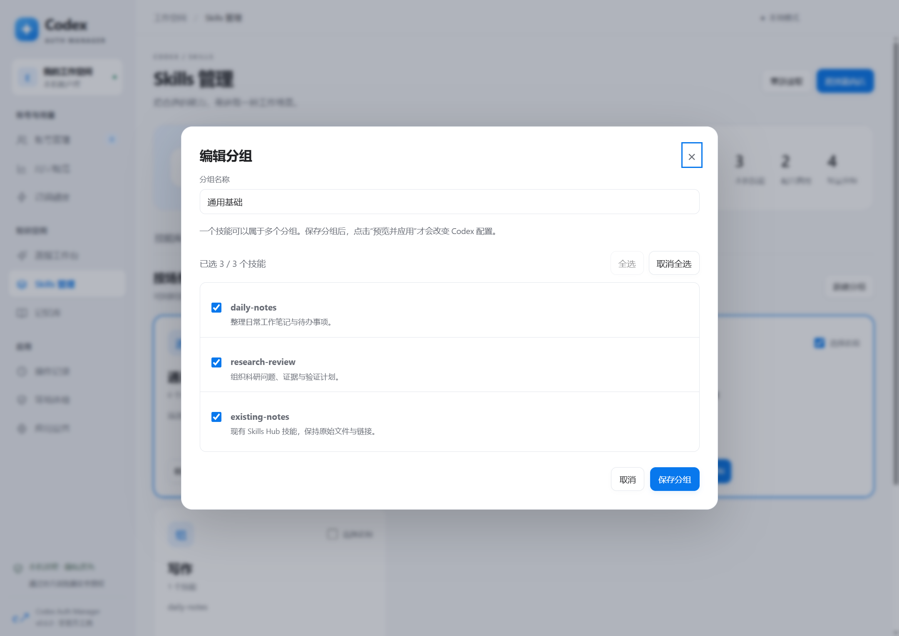
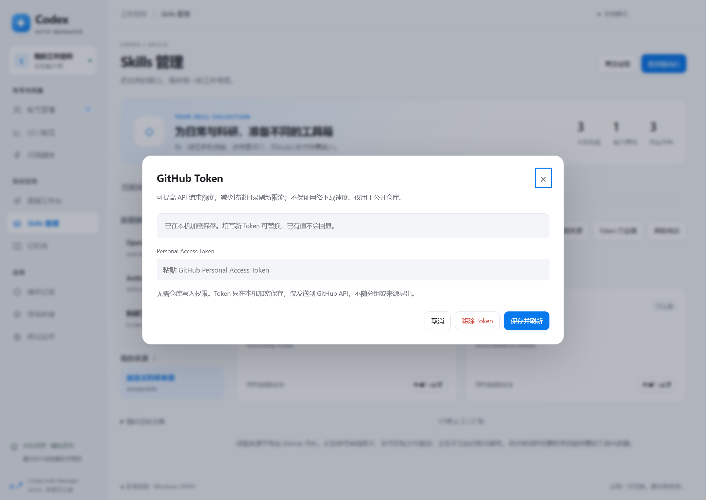

# Skills 管理（v0.6.0 预览版）

## 使用方式

1. 打开「Skills 管理 → 技能库」。读取 `CODEX_HOME/skills`、本机 `.agents/skills` 与 `.skillshub` 中的技能，按真实路径合并已有链接。系统目录与插件自带技能不参与切换。
2. 在「技能商店」选择 OpenAI、Anthropic 或科研工具箱，也可点击「发现技能」旁的「添加」，保存自定义公开 GitHub 仓库及分支 / Tag / 提交。打开技能，审阅完整 SKILL.md、文件数量和仓库许可证，选择分组后安装。
3. 安装只入库，不自动启用，也不执行附带脚本。在「场景分组」编辑名称和成员，一个技能可以属于多组。内置通用基础、日常、科研，可添加自定义组。编辑分组时，用「全选」「取消全选」操作整个技能列表，已选数量实时更新；底部「取消」放弃未保存修改。
4. 勾选一个或多个组并预览，或点击「切换此组」（保留通用基础，替换其他组）。查看将启用 / 停用的技能，点击「保存启用配置」。
5. 保存任务后自行重启 Codex 使用新组合。工具显示的是配置状态，不能证明正在运行的任务已重新加载。

## 自定义来源

- 「我的来源」保存来源名称、仓库及引用，重启应用后仍可直接点击。仓库填写 `owner/repo` 或 `https://github.com/owner/repo`；分支 / Tag / 提交单独填写，留空使用 `HEAD`。不填写 `/tree/...` 页面地址。
- 选择自定义来源后可「编辑来源」或「移除来源」。移除仅删除收藏，不删除已安装技能、不改变分组及启用状态。内置来源保留。
- 「临时读取仓库」支持不保存直接浏览；读取后可「保存为来源」。离线也能保存来源，网络恢复后再读取目录；保存不代表仓库已验证可访问。
- 每个应用数据目录最多保存 40 个自定义来源；同一仓库和相同引用不可重复添加。当前仅支持公开 GitHub 仓库。

## 本地文件和兼容性

- 保留 Skills Hub 的源文件与现有链接，不修改它的数据库。新安装技能放在 `.skillshub/cam-名称-来源标识`，应用时链接到 Codex skills 目录；同名目标拒绝覆盖。
- 通过本机 Codex CLI 的隐藏 `app-server` 使用 `config/read` 和带版本校验的 `config/batchWrite`，只修改 `skills.config`。保留无关设置和注释，不请求登录、额度或模型生成。需要支持这两个方法的官方 CLI；旧版本报错时请升级。
- 配置依据用户层的技能规则；企业策略、项目规则或运行中的会话还可能影响实际可用状态。组外且从未被此工具管理的技能保持原配置；曾被管理的技能移出组后会在下次应用时停用。
- 分组、自定义来源和安装记录存于应用数据目录下 `skills/library.json`，配置更改前将原有技能规则记录到 `skills/last-apply.json`，不复制包含其他设置的完整 config.toml。
- 分组编辑与安装、应用使用版本校验；过期预览需重新读取。启用过程如配置保存后链接失败会明确报告，并保留恢复记录，不声称已完成。

## GitHub Token

商店标题右侧的「GitHub Token」可保存、更换或移除 Personal Access Token。点击「保存并刷新」会立即以认证请求重新读取目录；已有 Token 不回显。没有 Token 也能通过匿名访问、缓存和仓库快照读取。

- Token 仅通过系统加密保存在应用数据目录的 `skills/github-token.enc`，不会进入来源列表、分组、导出或 Git 仓库；无法使用系统加密时拒绝保存。
- Token 只发送到 `https://api.github.com`，禁止自动跟随重定向，不发送到 raw 文件、Git refs 或 codeload 下载通道。
- 本功能用于公开仓库，只需公开数据读取能力，不需要仓库写入权限；不读取 Git / gh 的已有认证。可在 [GitHub 设置](https://github.com/settings/personal-access-tokens) 创建专用 Token。
- 认证请求提高 API 请求额度、减少匿名限流；网络速度仍取决于连接情况。配额与其他调用共享，仍可能限流，见 [GitHub 限流说明](https://docs.github.com/en/rest/using-the-rest-api/rate-limits-for-the-rest-api)。Token 过期或撤销时更新或移除即可。

## 商店边界

- 当前支持公开 GitHub 仓库，不支持私有仓库凭据。内置来源分别只浏览约定的技能目录；自定义来源寻找 SKILL.md。
- 目录缓存 10 分钟，限流或离线时优先展示已有缓存；每个目录最多显示 500 个技能，超限提示实际总数。卡片每批显示 60 项，可继续加载，搜索覆盖已读取目录。
- 预览绑定具体提交，10 分钟有效。安装逐个核对 Git blob 摘要；拒绝目录穿越、符号链接、子模块、大小写冲突与覆盖已有目录。单技能最多 500 个文件、单文件 2 MB、总计 20 MB。
- 保留完整技能文件及所找到的仓库许可证。没有许可证时显示缺失，用户需确认使用许可。GitHub API 限流时记录恢复时间，不反复请求。无缓存时自动通过 GitHub 官方 Git 引用与 codeload 快照读取固定提交，无需 Git 命令或必须配置 GitHub Token；同一目录的并发请求合并。两条通道均不可达时显示简洁错误，不显示内部 IPC 调用堆栈。
- 仓库快照有 64 MB 压缩体积 / 256 MB 展开体积 / 50000 条目保护限制。只在内存中解析目录与摘要，不解压到工作目录；安装仍检查固定提交文件摘要及单技能大小限制。
- 技能自己的工具、账号和运行依赖需另行配置；安装成功不等于技能适用于 Codex 或已经验证运行结果。当前不自动更新或卸载技能源文件。

## 验证与维护

`npm test` 包含 YAML、路径、缓存、下载完整性、已有链接、场景组合与版本冲突测试。`npx electron scripts/skills-smoke.js` 使用隔离数据验证真实 main / preload / 页面流程；加 `--packaged` 检查 ASAR。`node scripts/skills-config-smoke.js` 使用本机官方 CLI 与临时 CODEX_HOME 检查配置保存，不调用模型。

参考仓库与版本见 [第三方说明](THIRD_PARTY.md)，当前验证范围见 [验证记录](VALIDATION.md)。
